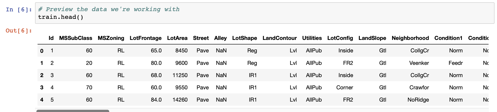
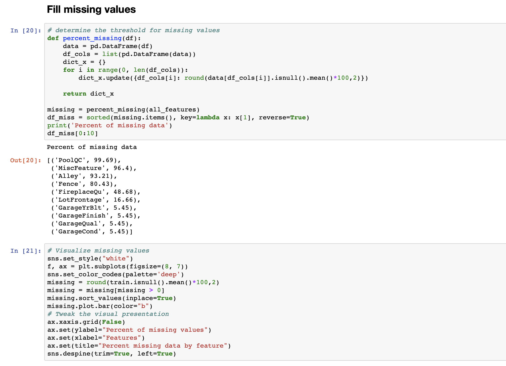
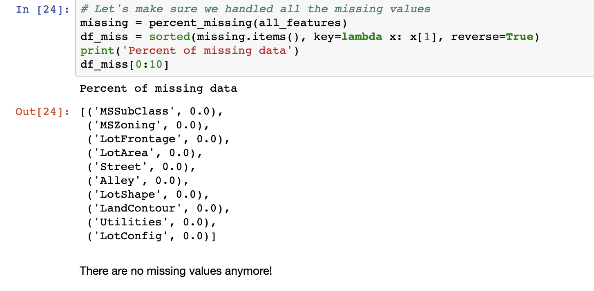
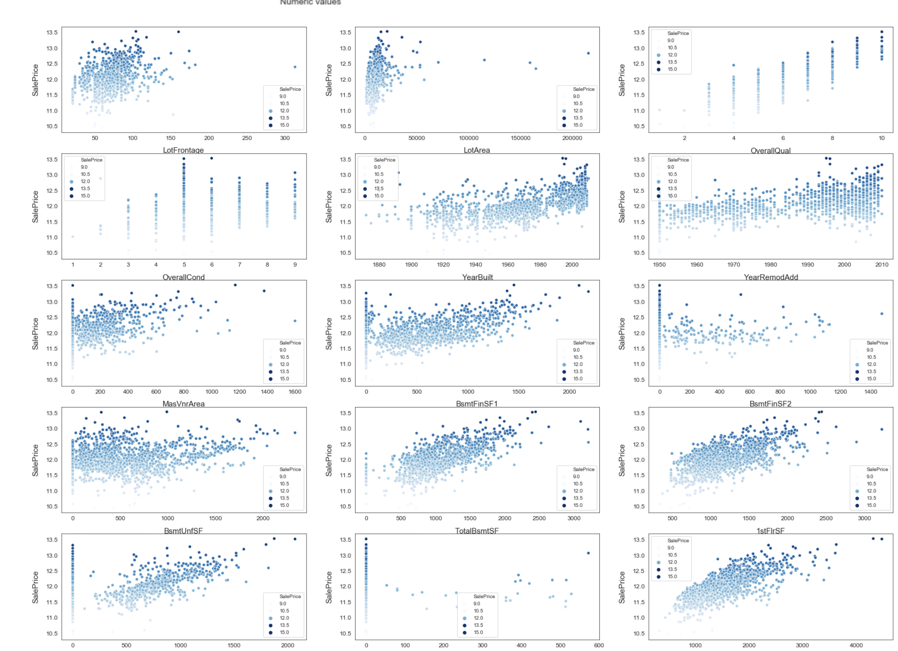
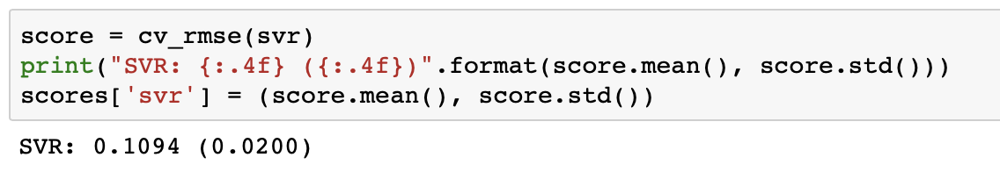

# Kaggle Competition报告
## 环境、数据准备
### 导入相关库并忽略警告信息

### 读取训练集和测试集

## EDA
### 数据集中的每一行描述房子的特征，根据这些特征预测销售价格

### 销售价格：打算预测的变量

### 特征处理
先对数据集中特征可视化处理：  

绘制这些特征之间的关系，以及与销售价格的关系  

绘制销售价格与数据集中的一些特性之间的关系

## 特征工程
### 房子销售分布情况

### 现在销售价格是正态分布

## 填补缺失值

## 为每个特性添加缺失值

这样就没有缺失值了  
## 解决倾斜特征

用scipy函数boxcox1p来计算Box-Cox转换，找到一个简单的转换方式使数据规范化  

现在，所有特征是正态分布  
## 创造有趣特征
ML模型很难识别更复杂的模式，所以可以基于对数据集的直觉创建一些特征来帮助模型，比如，每个房子地板总面积、浴室和门廊面积  

## 特征转换
通过计算数值特征的对数和平方变换来创建更多的特征  

## 编码分类特征
因为大多数模型只能处理数字特征，所以采用数字编码分类特征  

## 重新创建训练集和测试集

## 可视化训练模型的一些特征

## 训练模型
### 设置交叉验证并并以错误度量

## 设置模型

## 训练模型
### 获得每个模型的交叉验证分数

## 混合模型得到预测值

## 确定性能最佳模型

从上图中可以看出，混合模型的RMSLE为0.075，远远优于其他模型，这是最终预测的模型  

## 提交预测值
